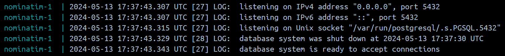
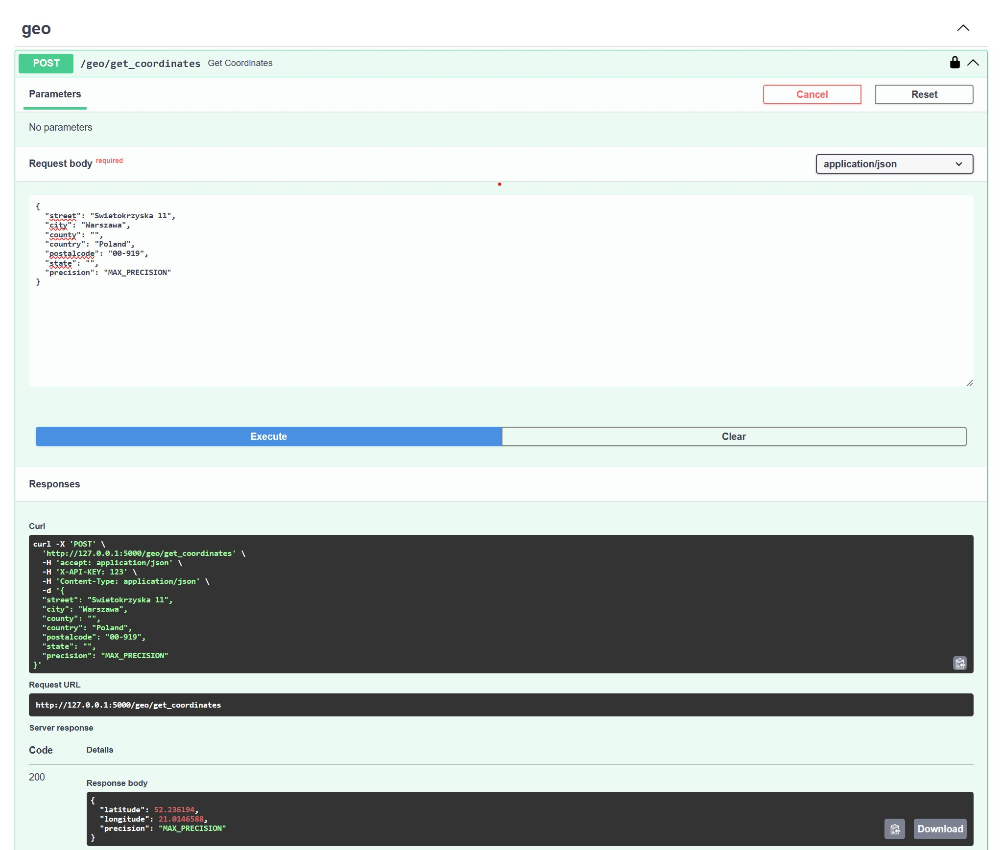
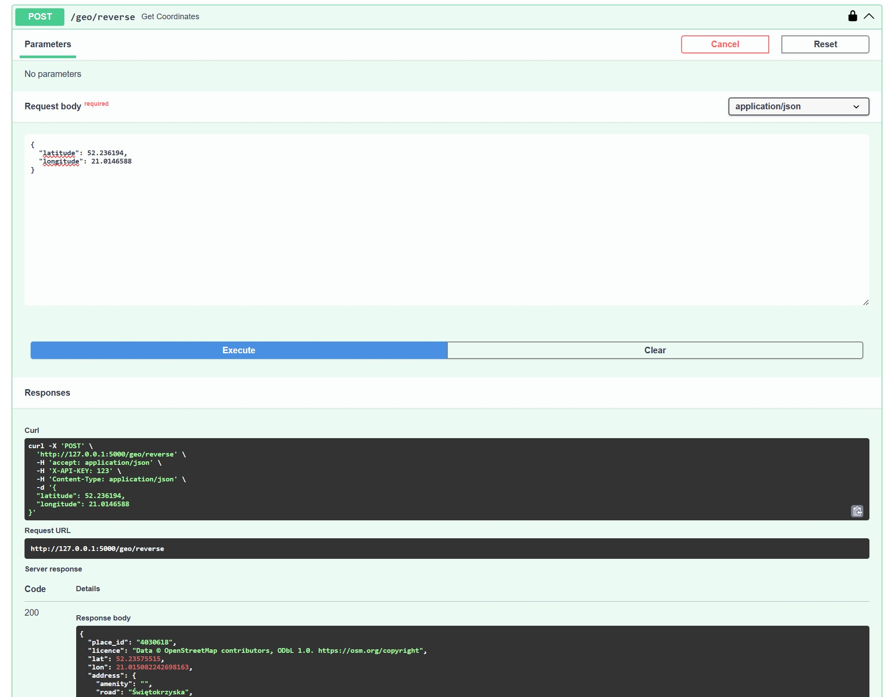

# Nominatim API

An application in the form of an API for retrieving coordinates from
addresses and addresses from coordinates (reverse geocoding).
Project based on Nominatim software. It is a self-hosted alternative
to the Google Maps API.


- [Requirements](#requirements)
  - [API](#api)
  - [Nominatim](#nominatim)
- [Details](#details)
- [Screenshots](#screenshots)
- [Run](#run)
- [Tests](#tests)
- [Coverage](#coverage)


## Requirements
### API
- Python 3.10+
- Docker >=  24.0.5
- docker-compose >= 2.23.3

### Nominatim
- 8GB RAM
- 40GB+ Disk space (depending on the .osm map file)

## Details
This solution is based on self-hosted Nominatim server, as a free alternative for Google Maps API.  
When you start container with nominatim server for the first time, it required long time to load geo data (aprox. 2.5h, for 1.7GB Poland map file). After than next runs will be faster (2-3 min)  

To use Nominatim you need to choose a file with data. Nominatim will be able to work only with addresses or coordinates from country/continent, that you loaded.
When the data is loaded. You will see:
<details>
<summary>Click see image</summary>


</details>

You can find osm.pbf map data files here: https://download.geofabrik.de/

It is not recommended to load a file with data for the whole planet, for testing purposes use only the map of continents or countries.

According to the documentation:  
_For a full planet install you will need at least 1TB of hard disk space. 
Take into account that the OSM database is growing fast. Fast disks are essential.
Using NVME disks is recommended.
Even on a well configured machine the import of a full planet takes around 2 days.
When using traditional SSDs, 4-5 days are more realistic._  

More: https://nominatim.org/release-docs/latest/admin/Installation/  
Dockerhub image: https://hub.docker.com/repository/docker/wojtek9502/geo-nominatim-api

## Screenshots
<details>
<summary>Click to see screenshots</summary>
Get coordinates from address (geocoding):



Get address coordinates (reverse geocoding):


</details>

## Run
1. Create .env file in main dir. See .env.example
2. Install requirements:
   ```sh 
   make install
   ```
3. Create docker-compose file like below (change map data url if you want):
   ```yaml
   # See PBF_URL and REPLICATION_URL, change the name of the country in urls if you want
   # example for US:
   # PBF_URL: 'https://download.geofabrik.de/north-america/us-latest.osm.pbf'
   # REPLICATION_URL: 'https://download.geofabrik.de/north-america/us-updates/'
   
   version: '3.6'
   services:
     nominatim:
       image: 'mediagis/nominatim:4.4'
       container_name: 'nominatim-server'
       environment:
         TZ: Europe/Warsaw
         PBF_URL: 'https://download.geofabrik.de/europe/poland-latest.osm.pbf'
         REPLICATION_URL: 'https://download.geofabrik.de/europe/poland-updates/'
         IMPORT_WIKIPEDIA: 'false'
       volumes:
         - './volumes/nominatim-data:/var/lib/postgresql/14/main:rw'
         - './volumes/nominatim-flatnode:/nominatim/flatnode:rw'
       ports:
         - '9000:8080'
       shm_size: '8g'
       networks:
         - nominatim-network
   

     api:
       image: 'wojtek9502/wojtek9502/geo-nominatim-api'
       container_name: 'nominatim-api'
       command: ['python', 'run_http_server.py']
       environment:
         - APP_ENV: 'production'
         - API_AUTH_TOKEN: '<random str>'
         - NOMINATIM_URL: 'http://nominatim-api:8080'
       ports:
         - '8080:5000'
       networks:
         - nominatim-network
         
   networks:
     nominatim-network:
       driver: bridge
   ```
   
4. Run docker containers. 
   ```shell
   make up
   ```
5. Run worker
   ```shell
   make run-worker
   ```
6. Go http://127.0.0.1:8080/swagger-ui

## Tests
```shell
make test
```

## Coverage
```shell
make coverage
```